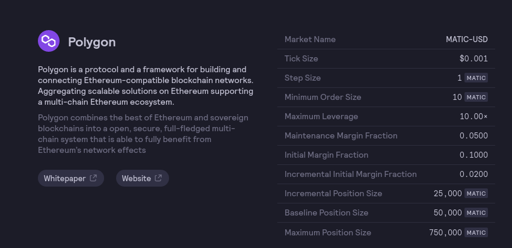

- __baselinePositionSize__: The largest position size (50,000 MATIC) at the default initial margin fraction (0.1 for MATIC). After surpassing this size, the initial margin fraction will linearly increase by 0.02 per 25,000 MATIC
- __incrementalPositionSize__: 25,000 MATIC, so for every 25,000 MATIC above 50,000 MATIC, the margin fraction increases by 0.02
- __maxPositionSize__: max amount your position can be

see [here](https://help.dydx.exchange/en/articles/5232637-maximum-position-sizes) for help article

[hummingbot has articles on how to connect to defi protocols](https://docs.hummingbot.io/connectors/dydx-perpetual/)
